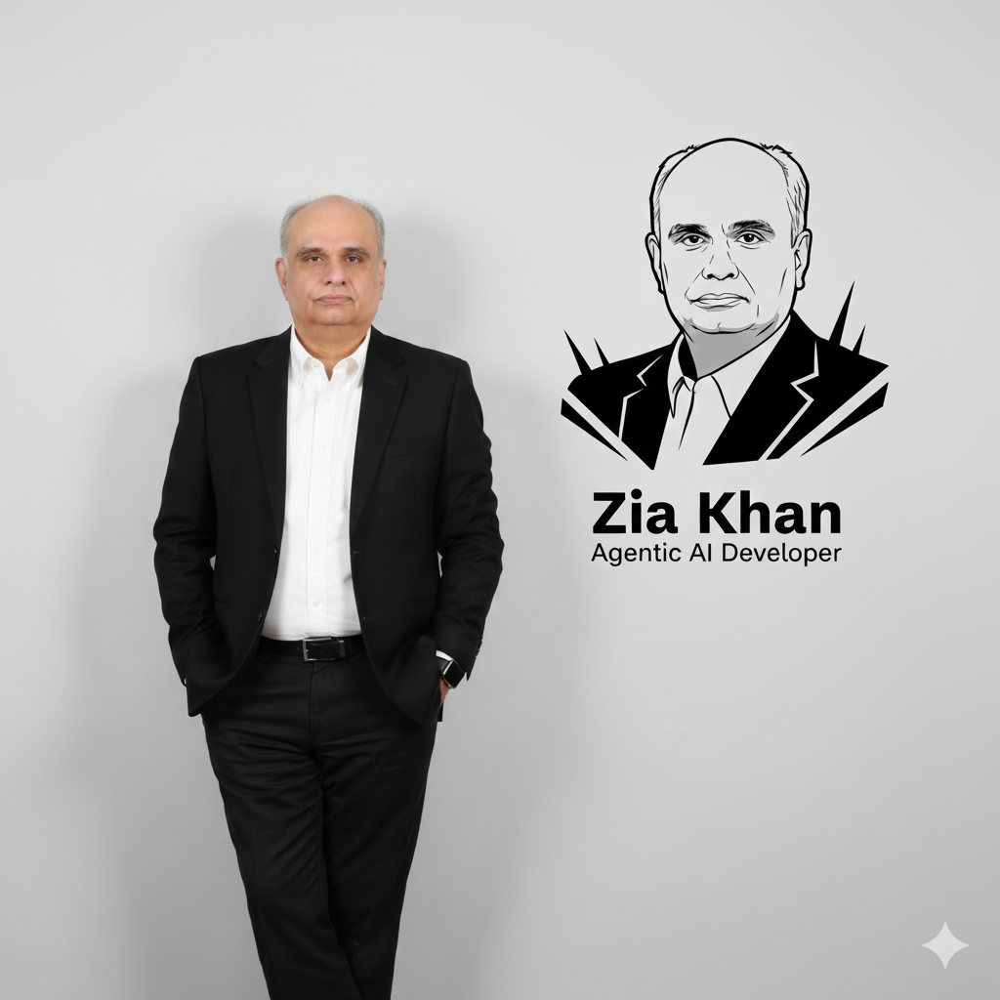
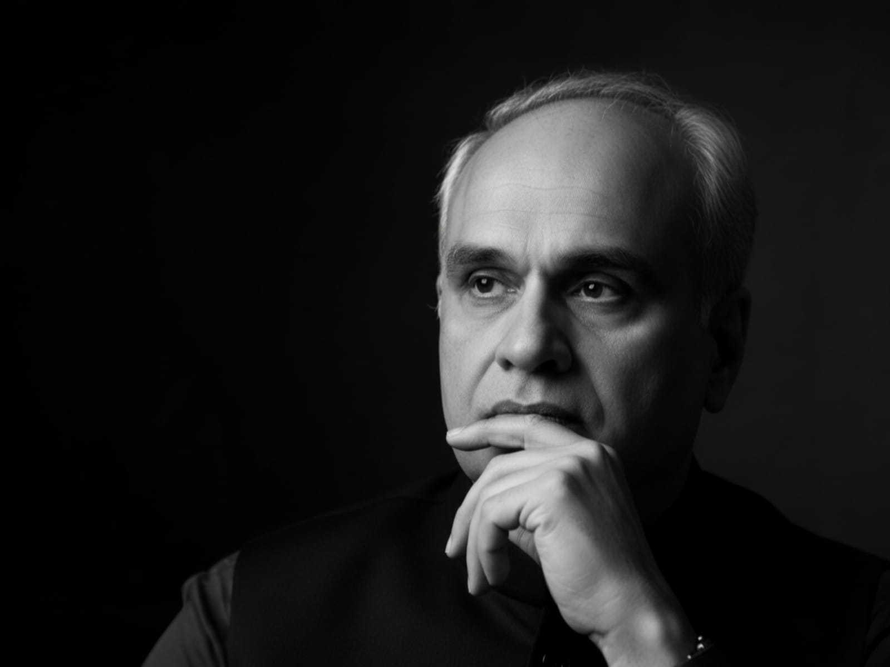
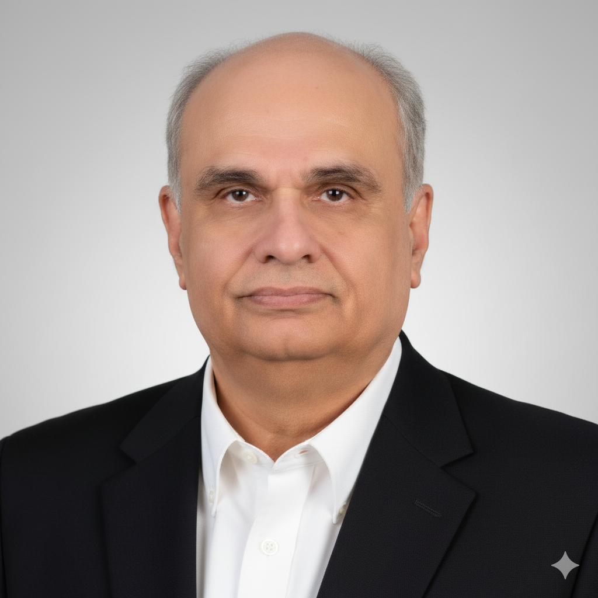
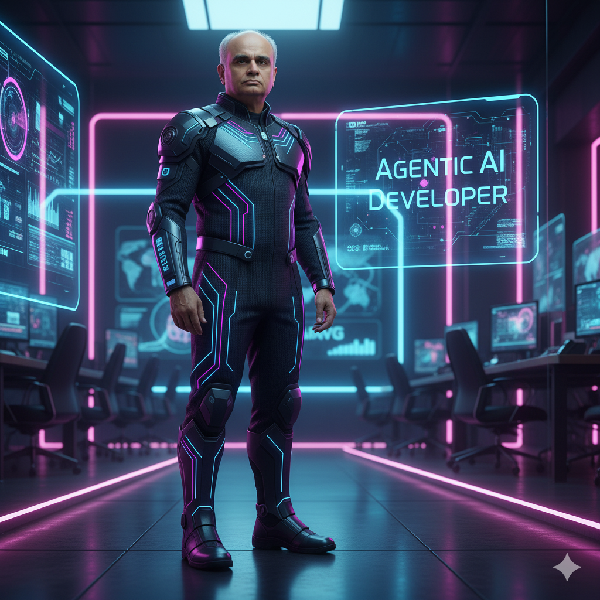
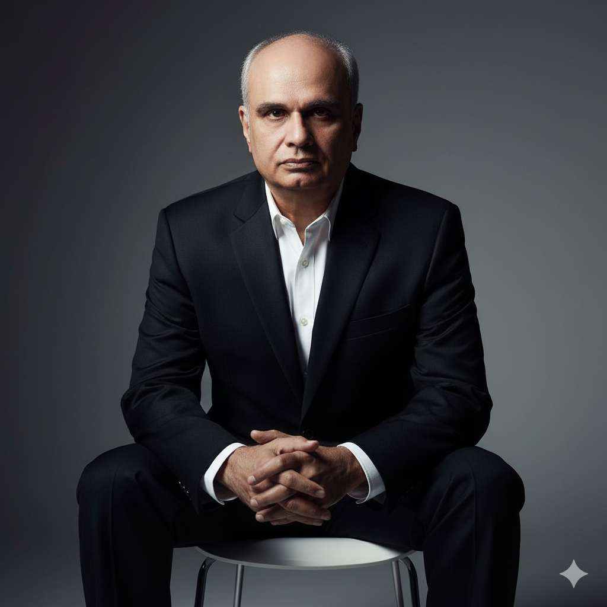
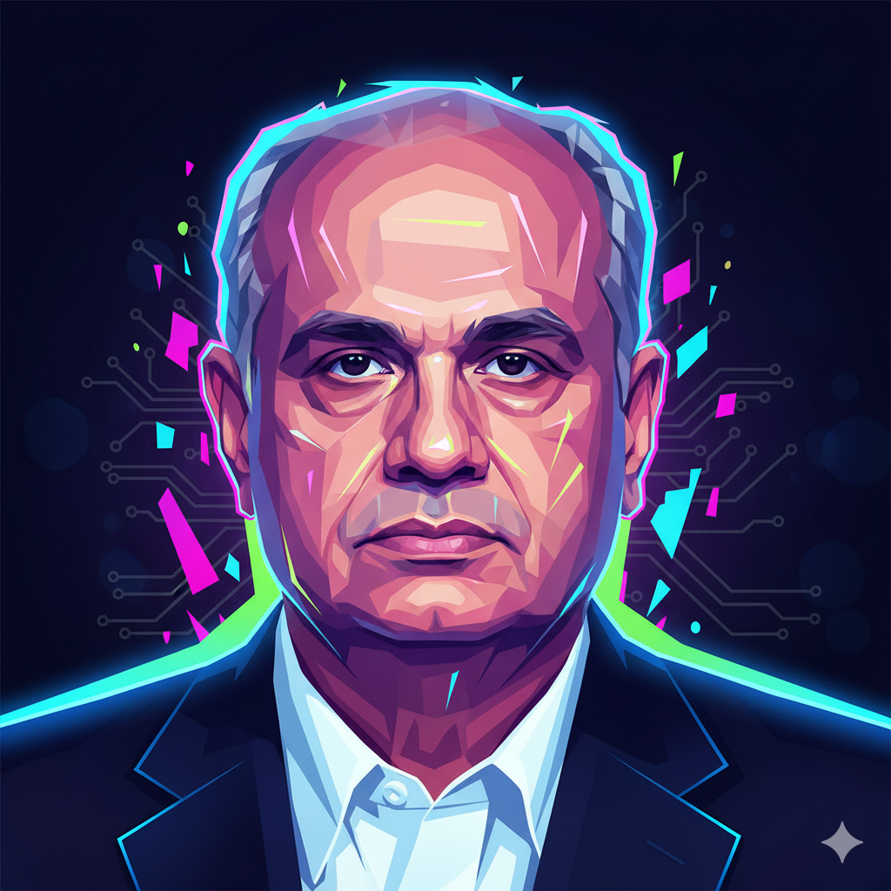

# Prompt Engineering Tutorial for Nano Banana

*By Example — with Real Prompts and Outputs*

Prompt at https://gemini.google.com/

Google Nano Banana (like MidJourney, DALL·E, or Stable Diffusion) responds to highly descriptive prompts. The more structured, visual, and contextual your input, the closer the output matches your intent.

---

## Core Principles

### 1. **Specificity Over Generality**
- Vague: "a nice portrait"
- Better: "hyper-realistic studio portrait with professional lighting"

### 2. **Visual Hierarchy**
- Start with the main subject
- Add environment/background
- Specify lighting and mood
- Include technical details

### 3. **Professional Photography Language**
- Use camera terminology (85mm lens, f/1.4, shallow depth of field)
- Reference lighting setups (Rembrandt lighting, studio lighting)
- Mention photography styles (editorial, cinematic, fine art)

## Anatomy of Effective Prompts

A well-structured prompt typically includes:
1. **Subject Description** (who/what)
2. **Pose/Action** (body language, positioning)
3. **Environment** (background, setting)
4. **Lighting** (type, direction, mood)
5. **Style** (aesthetic, genre)
6. **Technical Specifications** (camera settings, composition)
7. **Mood/Atmosphere** (emotional tone)

---

## 🔹 Example 1: Professional Branding Portrait

**Prompt Used (from your case):**

```
Hyper-realistic full-body portrait of the uploaded photo, standing casually against a smooth light-gray wall. The outfit is as worn as in winter. The hands are inside the pockets, the left hand wears a square smartwatch, one leg casually crossed over the other, relaxed and confident posture. The lighting is a professional studio, bright yet soft, premium clarity.

On the wall beside him is a bold black-and-white stylized vector portrait of the same subject, rendered with modern geometric accents. Beneath the graphic, add clean bold text 'Zia Khan' in large type, and below it is a smaller font 'Agentic AI Developer'

Mood & Style: modern, minimalistic, premium personal-branding aesthetic, sharp contrast, sleek composition.
```
Original Image:


Generated:



✅ **What Worked Here**

* **Subject grounding**: “of the uploaded photo” ensures consistency.
* **Pose instructions**: “hands inside the pockets, leg casually crossed” avoids random posture.
* **Context & setting**: “smooth light-gray wall, professional studio lighting” makes it brand-safe.
* **Extra elements**: vector portrait + typography = personal brand identity.

💡 **Takeaway Rule:** *For branding prompts, combine subject grounding + posture + context + design elements (like logos or text).*

---

## 🔹 Example 2: Cinematic Black & White Portrait

**Prompt Used:**

```
{
  "prompt": "create moody black and white portrait of a man, hand resting near mouth, deep gaze into distance, dramatic shadows across his face, expressive wrinkles, soft rembrandt  light from the side, cinematic atmosphere, professional portrait photography style, shot on 85mm lens f/1.4, shallow depth of field, high contrast, fine art photography, editorial feel",
  "style": "cinematic, moody, introspective",
  "lighting": "soft side lighting, high contrast shadows, natural light imitation",
  "camera": {
    "Model": "Leica SL2-S",
    "lens": "85mm",
    "aperture": "f/1.4",
    "depth_of_field": "shallow",
    "angle": "close-up portrait, slightly off-center framing"
  },
  "mood": "thoughtful, reflective, timeless"
}
```

or 

```
create moody black and white portrait of a man, hand resting near mouth, deep gaze into distance, dramatic shadows across his face, expressive wrinkles, soft rembrandt light from the side, cinematic atmosphere, professional portrait photography style, shot on 85mm lens f/1.4, shallow depth of field, high contrast, fine art photography, editorial feel
```


**Style Metadata:**

* Style: cinematic, moody, introspective
* Lighting: soft side lighting, high contrast shadows
* Camera: Leica SL2-S, 85mm f/1.4, shallow DoF
* Mood: thoughtful, reflective, timeless

Generated:




✅ **What Worked Here**

* **Mood anchoring**: “moody, cinematic, introspective” frames the emotional tone.
* **Photography realism**: camera & lens details simulate professional photography.
* **Lighting control**: “Rembrandt light” + “high contrast” = timeless look.

💡 **Takeaway Rule:** *For artistic portraits, describe mood, lighting style, and camera lens to mimic photography realism.*

---

## 🔹 Example 3: Corporate Headshot

**Prompt:**

```
Professional corporate headshot of a confident middle-aged man, wearing a tailored dark suit and white shirt, subtle smile, neutral blurred background, evenly lit with soft studio lights, sharp focus on the face, natural skin tones, minimal retouching, LinkedIn profile photo style.
```

Generated:




✅ **Why This Works:**
It creates a clean, realistic image suitable for resumes, LinkedIn, or official documents.

---

## 🔹 Example 4: Futuristic Branding Poster

**Prompt:**

```
Full-body futuristic portrait of the uploaded subject, standing in a sleek cyberpunk office with neon blue and purple accents. Outfit transformed into a smart-tech suit with glowing circuits along the fabric. Holographic display beside him showing the words: 'Agentic AI Developer'. Style: cinematic, glossy, high-tech corporate branding aesthetic.
```

💡 **Use Case:** Great for AI events, keynotes, or futuristic branding material.


Generated:



---

## 🔹 Example 5: Magazine Editorial Style

**Prompt:**

```
Editorial fashion portrait of a man sitting on a modern chair, dressed in a sharp black suit with no tie, intense gaze into the camera. Lighting dramatic with deep shadows and highlights, glossy magazine style, Vogue photography, minimal background with gradient tones, cinematic 50mm lens effect.
```

💡 **Use Case:** Stylish professional portfolios or publications.

Generated:



---

## 🔹 Example 6: Abstract Creative Variant

**Prompt:**

```
Digital abstract vector art of the uploaded subject, face geometrically stylized with sharp angular lines, vibrant neon gradient colors, glowing outlines, futuristic tech-hero aesthetic, suitable for modern branding and event posters.
```

💡 **Use Case:** Event banners, creative keynote posters, or website hero images.

Generated:



---

# 📝 Best Practices for Prompt Engineering in Nano Banana

1. **Anchor the Subject**

   * Always mention: *“of the uploaded photo”* to retain likeness.

2. **Control the Scene**

   * Use **environment cues**: background, wall, lighting, props.

3. **Specify Style & Mood**

   * Example moods: cinematic, corporate, fine art, futuristic.

4. **Borrow from Photography**

   * Camera/lens terms like *85mm f/1.4* create realism.
   * Lighting terms like *Rembrandt, softbox, backlight* help shape mood.

5. **Add Branding Elements**

   * Vector logos, text overlays, geometric accents.

6. **Iterate in Layers**

   * Start broad (*“corporate portrait”*), then refine with poses, props, typography.

---

## Advanced Techniques

### 1. Layered Lighting Descriptions
```
Primary: soft key light from camera left
Secondary: subtle fill light to reduce shadows
Accent: rim light from behind for separation
Ambient: warm studio ambiance, controlled spill
```

### 2. Composition Rules
```
Rule of thirds placement, subject positioned at left intersection
Leading lines from architectural elements
Negative space on right side for text overlay
Shallow depth of field with bokeh background blur
```

### 3. Color Psychology Integration
```
Warm golden hour tones for approachability
Cool blue shadows for professionalism
High contrast black and white for timeless elegance
Muted earth tones for organic, natural feel
```

## Style Categories

### Corporate/Professional
```
Executive portrait: sharp business attire, confident posture, neutral background, even lighting, shot with 85mm lens, shallow depth of field, professional headshot style, clean composition, corporate environment
```

### Creative/Artistic
```
Artist portrait: creative workspace background, natural lighting from large window, relaxed casual attire, hands engaged with creative tools, environmental storytelling, documentary photography style, 35mm lens, authentic candid moment
```

### Fashion/Editorial
```
High-fashion portrait: dramatic pose, designer clothing, studio backdrop with gradient lighting, professional hair and makeup, editorial magazine style, shot with medium format camera, sharp details, fashion photography aesthetic
```

### Lifestyle/Personal Branding
```
Lifestyle portrait: modern home office setting, natural window light, smart casual attire, confident yet approachable expression, environmental context showing personality, lifestyle photography style, authentic moment capture
```

## Common Mistakes to Avoid

### ❌ Too Vague
**Bad:** "nice portrait of a person"
**Good:** "professional headshot with studio lighting and neutral background"

### ❌ Conflicting Styles
**Bad:** "vintage film aesthetic with modern digital clarity"
**Good:** "vintage-inspired styling with modern professional photography techniques"

### ❌ Overcomplicating
**Bad:** "surreal artistic avant-garde experimental abstract conceptual portrait"
**Good:** "creative portrait with artistic lighting and thoughtful composition"

### ❌ Missing Key Elements
**Bad:** "person standing"
**Good:** "confident business professional standing against clean white background, professional studio lighting, corporate headshot style"

## Best Practices

### 1. Use Reference Photography Terms
- **Studio lighting:** key light, fill light, rim light, background light
- **Natural lighting:** golden hour, blue hour, window light, overcast
- **Moods:** dramatic, soft, high-key, low-key, moody, bright and airy

### 2. Specify Camera Equipment When Needed
```
Shot with professional DSLR camera
85mm portrait lens for flattering compression
f/2.8 aperture for subject separation
ISO 100 for maximum image quality
```

### 3. Include Environmental Context
```
Modern corporate office environment
Clean white seamless backdrop
Urban rooftop with city skyline
Natural outdoor setting with soft shadows
```

### 4. Layer Your Descriptions
Start broad, then add specifics:
1. Subject type: "Professional business portrait"
2. Add specifics: "of a confident executive"
3. Include environment: "in a modern office setting"
4. Specify lighting: "with soft natural window light"
5. Add technical: "shot with 85mm lens, shallow depth of field"
6. Define mood: "conveying leadership and approachability"

### 5. Use Structured Formatting

**Method 1: Paragraph Style**

```
Professional corporate headshot of a business executive, standing confidently in a modern office environment. Clean business attire, direct eye contact with camera, subtle smile conveying approachability. Soft natural lighting from large office windows, complemented by subtle fill lighting. Shot with 85mm lens at f/2.8 for subject separation. Modern, clean aesthetic with neutral color palette. High-end corporate photography style.
```

**Method 2: Categorized Style**

```
SUBJECT: Corporate executive, professional attire
POSE: Standing confidently, direct eye contact, subtle smile
ENVIRONMENT: Modern office, clean professional setting
LIGHTING: Soft natural window light with fill lighting
CAMERA: 85mm lens, f/2.8 aperture, shallow depth of field
STYLE: High-end corporate photography, clean modern aesthetic
MOOD: Confident, approachable, professional leadership
```

**Method 3: JSON Structure** (for complex requirements)

```json
{
  "subject": "professional business portrait",
  "pose": "confident standing position, direct gaze",
  "environment": "modern corporate office",
  "lighting": {
    "primary": "soft natural window light",
    "secondary": "subtle fill lighting"
  },
  "camera": {
    "lens": "85mm",
    "aperture": "f/2.8",
    "style": "professional headshot"
  },
  "mood": "confident, approachable, executive presence"
}
```

## Advanced Example Templates

### Template 1: Corporate Executive

```
Professional executive portrait: [SUBJECT] in sharp business attire, standing confidently with hands [HAND_POSITION], direct eye contact conveying [MOOD]. Modern corporate environment with [BACKGROUND_DETAIL]. Studio lighting setup with soft key light from camera left, subtle fill light, rim lighting for separation. Shot with 85mm portrait lens at f/2.8, shallow depth of field. High-end corporate photography style, clean composition, neutral professional color palette.
```

### Template 2: Creative Professional

```
Creative professional portrait: [SUBJECT] in [ATTIRE_STYLE], positioned [POSE] in [CREATIVE_ENVIRONMENT]. Natural lighting from [LIGHT_SOURCE], creating [LIGHT_QUALITY] illumination. Environmental storytelling elements including [PROPS/CONTEXT]. Documentary photography style with [LENS_TYPE], capturing authentic [MOMENT/EXPRESSION]. Color palette of [COLORS] to reflect [BRAND/PERSONALITY].
```

### Template 3: Lifestyle/Personal Brand

```
Lifestyle portrait: [SUBJECT] in [SETTING], wearing [CASUAL_ATTIRE], engaged in [ACTIVITY/POSE]. Natural [TIME_OF_DAY] lighting creating [MOOD], shot in [LOCATION_TYPE]. [CAMERA_SPEC] for [DEPTH_EFFECT]. Lifestyle photography aesthetic focusing on [BRAND_ATTRIBUTES]. Authentic, relatable, [EMOTIONAL_TONE] atmosphere.
```

## Quality Control Checklist

Before submitting your prompt, verify:
- [ ] Subject is clearly described
- [ ] Pose/positioning is specific
- [ ] Lighting type and direction are specified
- [ ] Environment/background is detailed
- [ ] Camera/technical specs enhance the vision
- [ ] Mood and style are clearly communicated
- [ ] No conflicting elements
- [ ] Professional photography language is used
- [ ] The prompt flows logically from main subject to details

## Conclusion

Effective prompt engineering for nano banana combines artistic vision with technical precision. By following these principles and studying the examples provided, you'll be able to consistently generate professional-quality portraits that meet your specific requirements. Remember: specificity, structure, and professional photography terminology are your keys to success.

Practice with these templates, adapt them to your needs, and develop your own style of prompt engineering. The more specific and well-structured your prompts, the better your results will be.