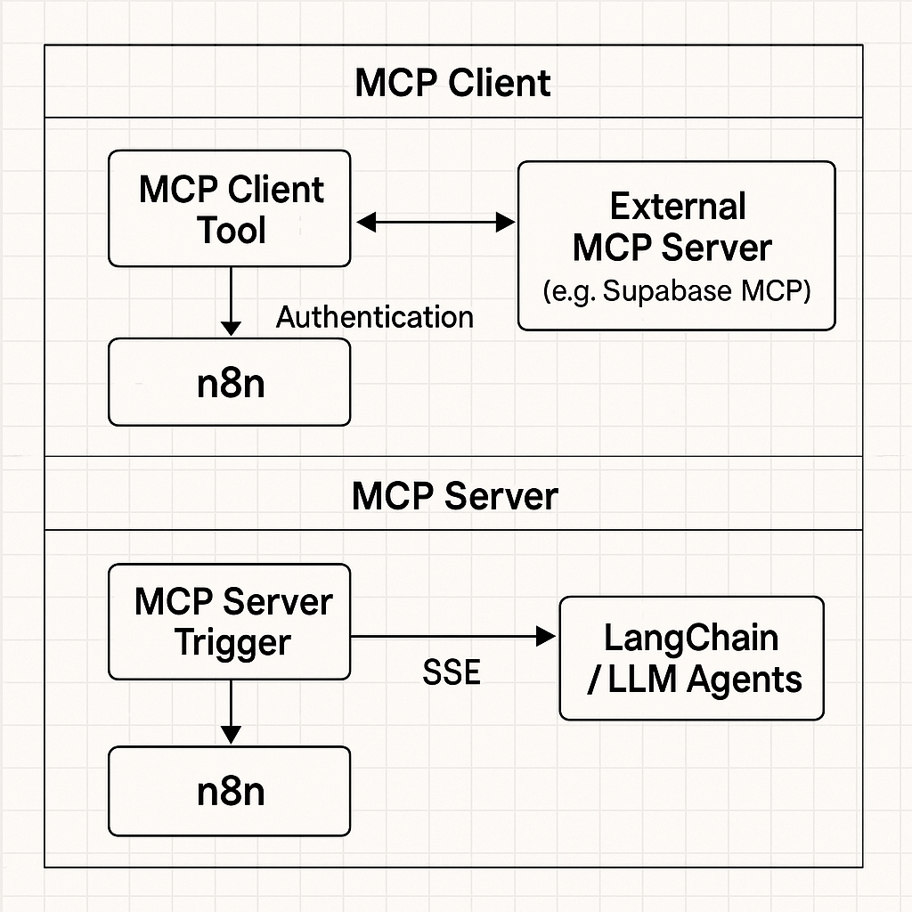

# Model Context Protocol (MCP) with n8n

## I. Using MCP Servers with n8n Agents

We will cover this tutorial in class:

[The Ultimate n8n MCP Step-by-Step Guide for Beginners | 2025](https://generect.com/blog/n8n-mcp/)

n8n interacts with MCP as an MCP client via the [MCP Client Tool node](https://docs.n8n.io/integrations/builtin/cluster-nodes/sub-nodes/n8n-nodes-langchain.toolmcp/) to use external tools by connecting to MCP servers with authentication. Additionally, n8n acts as an MCP server through the [MCP Server Trigger node](https://docs.n8n.io/integrations/builtin/core-nodes/n8n-nodes-langchain.mcptrigger/) to expose its tools and workflows using SSE and configurable URLs with authentication

Note: Comprehensive Tutorial is available at the end of this page

You will watch these videos at home:

[MCP is GAME CHANGING!! | Full n8n MCP Tutorial](https://www.youtube.com/watch?v=GB2RZ25HTD8)

[Build Anything with MCP in n8n, Here's How!](https://www.youtube.com/watch?v=Hs89msXJiIc)

## II. Building Workflows with n8n MCP

[This n8n MCP is INSANE! Why it Might Replace Manual Workflows](https://www.youtube.com/watch?v=sJ-38ew1YZk)

[This n8n mcp is INSANE... Let AI Create your Entire Automation](https://www.youtube.com/watch?v=xf2i6Acs1mI)

III. Supabase

https://supabase.com/docs/guides/getting-started/mcp

Got it ✅
Here’s your **comprehensive tutorial** that blends the official docs, blog, and videos into a single **practical, structured guide** for learning **Model Context Protocol (MCP) with n8n** — including **Supabase MCP integration**.

---

# 📚 Comprehensive Tutorial: Model Context Protocol (MCP) with n8n

## 1. Introduction to MCP and n8n

MCP (Model Context Protocol) is an **open protocol for connecting AI models to tools and data sources**. It allows:

* **Clients** (like n8n or LLMs) to connect to **MCP servers** to run tools and access resources.
* **Servers** to expose capabilities that any MCP client can use.

**Why MCP in n8n?**

* Turn n8n into an **AI automation hub**.
* Let n8n **consume MCP tools** from other apps.
* Let n8n **expose its workflows** as MCP tools.

---

## 2. MCP Roles in n8n

### 2.1 n8n as an **MCP Client**

When n8n acts as an MCP client:

* It **connects to an external MCP server** (like a custom AI tool API or Supabase MCP server).
* Uses the **MCP Client Tool node** ([docs](https://docs.n8n.io/integrations/builtin/cluster-nodes/sub-nodes/n8n-nodes-langchain.toolmcp/)).
* You can run **authenticated MCP tool calls** directly from workflows.

🔹 **Example use cases**:

* Call a remote AI document summarizer.
* Run an SQL query on Supabase via MCP.
* Trigger a GPT-powered code generator.

---

### 2.2 n8n as an **MCP Server**

When n8n acts as an MCP server:

* It **exposes workflows and tools** to any MCP-compatible client.
* Uses the **MCP Server Trigger node** ([docs](https://docs.n8n.io/integrations/builtin/core-nodes/n8n-nodes-langchain.mcptrigger/)).
* Communicates via **Server-Sent Events (SSE)**.
* Supports **authentication** and **customizable URLs**.

🔹 **Example use cases**:

* Share an n8n-based automation as an MCP tool with an LLM agent.
* Give a chat-based AI access to your business data workflow.

---

## 3. Setting Up MCP in n8n

### 3.1 Prerequisites

* n8n installed (Cloud or self-hosted)
* API credentials for any MCP server you want to connect to (e.g., Supabase, custom tool)
* Basic understanding of workflows in n8n

---

### 3.2 n8n as MCP Client — Step-by-Step

1. **Create a New Workflow** in n8n.
2. **Add MCP Client Tool Node**:

   * Search for `MCP Client Tool` in the node selector.
   * Configure:

     * **Server URL**: The MCP server endpoint.
     * **Auth**: API key or token.
3. **Select Tool**: Pick the tool from the server’s capabilities list.
4. **Pass Parameters**:

   * Input fields vary depending on the tool.
5. **Execute Workflow**: Run and check the response.

📌 **Tip**: You can chain multiple MCP client calls to build complex AI-powered automations.

---

### 3.3 n8n as MCP Server — Step-by-Step

1. **Create a New Workflow** in n8n.
2. **Add MCP Server Trigger Node**:

   * Configure:

     * **Public URL** for SSE.
     * **Authentication method** (API key or OAuth).
3. **Connect Logic**:

   * Add your processing nodes after the trigger.
4. **Deploy Workflow**:

   * Your workflow is now an MCP tool others can call.

📌 **Tip**: Use this with GPT-4o, Claude, or LangChain agents to extend their toolset.

---

## 4. Supabase MCP with n8n

[Supabase MCP docs](https://supabase.com/docs/guides/getting-started/mcp)
Supabase provides an MCP server for direct database interactions.

### 4.1 Use Case Example: Querying Supabase from n8n

1. **Enable Supabase MCP** on your Supabase project.
2. Get:

   * Project URL
   * API Key
3. In n8n:

   * Add **MCP Client Tool** node.
   * Connect to Supabase MCP server.
   * Select `query` or `mutate` tool.
   * Pass SQL queries as parameters.
4. Use n8n’s built-in nodes to process or store results.

---

## 5. Example Workflows

### 5.1 AI Data Processing Pipeline

1. **MCP Client Tool (Supabase)** → Fetch rows.
2. **AI Text Processor** → Summarize data.
3. **MCP Client Tool (Custom)** → Store results in another DB.

### 5.2 n8n as AI Automation Service

1. **MCP Server Trigger** → Receive AI requests.
2. **n8n Logic** → Execute automation (email, data fetch, report generation).
3. **Respond to MCP Client** with results.

---

## 6. Learning Path

### In-Class (Hands-on)

* Read: [Ultimate n8n MCP Step-by-Step Guide for Beginners](https://generect.com/blog/n8n-mcp/)
* Practice:

  1. Create an n8n MCP client workflow calling a mock MCP server.
  2. Create an n8n MCP server workflow and test with a LangChain agent.

### At Home (Watch & Apply)

1. [MCP is GAME CHANGING!! | Full n8n MCP Tutorial](https://www.youtube.com/watch?v=GB2RZ25HTD8)
2. [Build Anything with MCP in n8n, Here's How!](https://www.youtube.com/watch?v=Hs89msXJiIc)
3. [This n8n MCP is INSANE! Why it Might Replace Manual Workflows](https://www.youtube.com/watch?v=sJ-38ew1YZk)
4. [This n8n mcp is INSANE... Let AI Create your Entire Automation](https://www.youtube.com/watch?v=xf2i6Acs1mI)

---

## 7. Best Practices & Tips

* Use **separate API keys** for MCP authentication per environment (dev/staging/prod).
* For n8n MCP servers, **limit tool exposure** to necessary workflows for security.
* For high-frequency AI calls, **batch data** to reduce requests.
* Monitor **latency** when chaining multiple MCP tools.

---

If you want, I can also create a **visual architecture diagram** showing **n8n as both MCP client and MCP server** so your students see the full data flow at a glance. This would make the tutorial even easier to follow.
